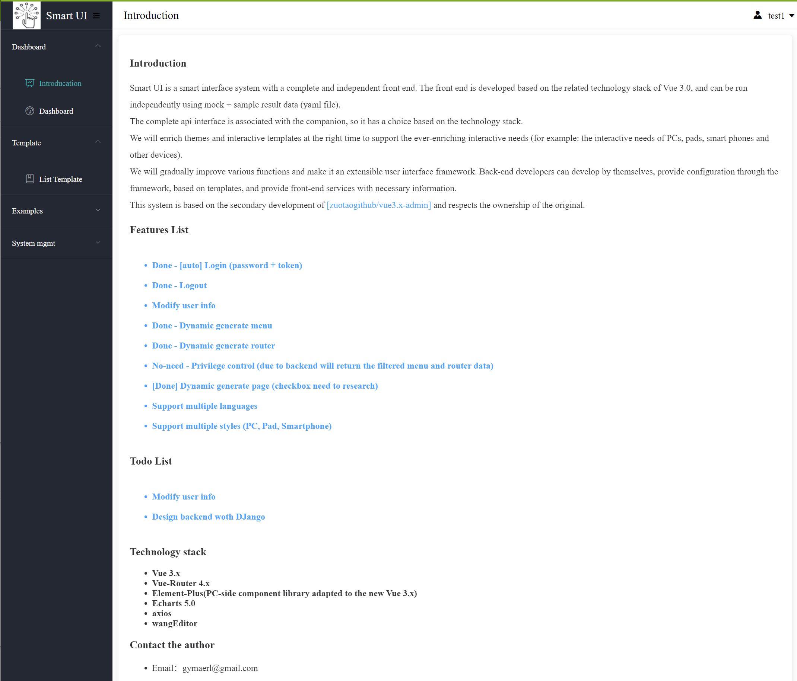
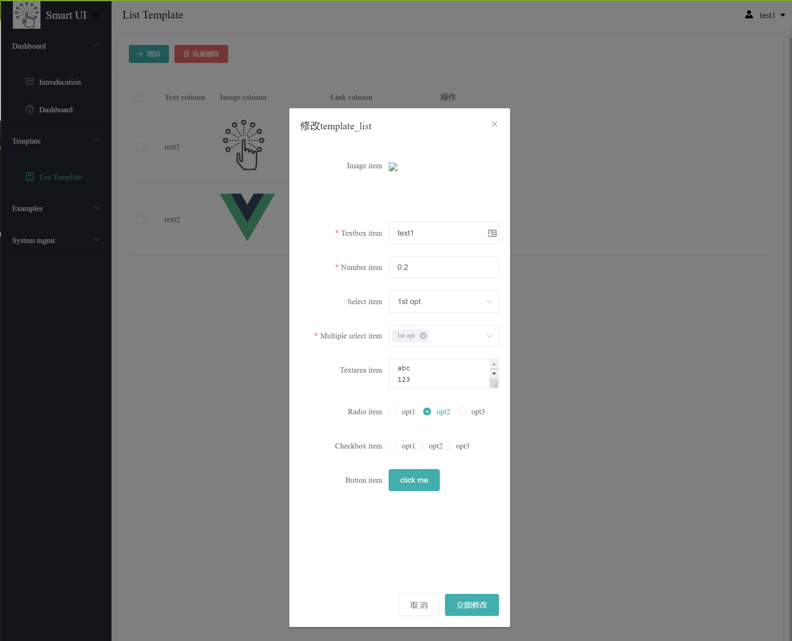

# smart-ui

web ui framework with technology stack []vue3 + Vue-Router + Element-Plus + Echarts + axios + mock]

* load menu info dynamatically

* load router info dynamatically

* generate page with layout metadata dynamatically

* debug with mock + yaml (no backend required)

### Note:

    This project is only used for personal technical research purposes. 
    If it is used for commercial purposes without the author’s consent, 
    the author reserves the right to pursue legal responsibility.

# How to use

* install node.js (include npm + yarn)

* start service

```bash
git clone git@github.com:gymaerl/smart-ui.git
cd smart-ui
yarn install
yarn run dev
```

* open [http://localhost:3000] in web browser





# Todo

* ## I will extend the templates to support chart soon

* ## I am happy to get any feedback if you are insterested on this
